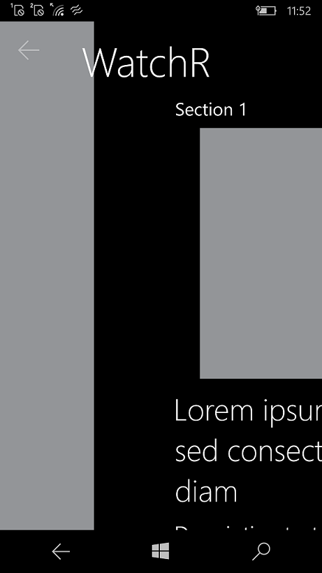

# Watchr

Watch right - some UWP UI experiments

## Screens

## UWP App 

[UWP tech](https://docs.microsoft.com/en-us/windows/uwp/get-started/universal-application-platform-guide) allows you to build cross-platform UIs for Win10Mobile, 
Windows XBox from a single, shared codebase. 

* Focus:
  * XAML UI
  * Behaviors
  * Converters
  * Custom Controls
  * Styles
  * Triggers
  * Dialogs
  * Layout Navigation
  

## Requirements

* Visual Studio 2022 Community Edition is fully supported

## Setup

**Download** or clone the repository. This is a solution with two projects.

**Rebuild** the solution to get all neccesary **NuGet** packages.

Enjoy!

 
## Clean and Rebuild

If you see build issues when pulling updates from the repo, try cleaning and rebuilding the solution.

## Copyright and license

Code released under the [MIT license](https://opensource.org/licenses/MIT).

AS IS. RnD only.

   -- [m][e] 2022
